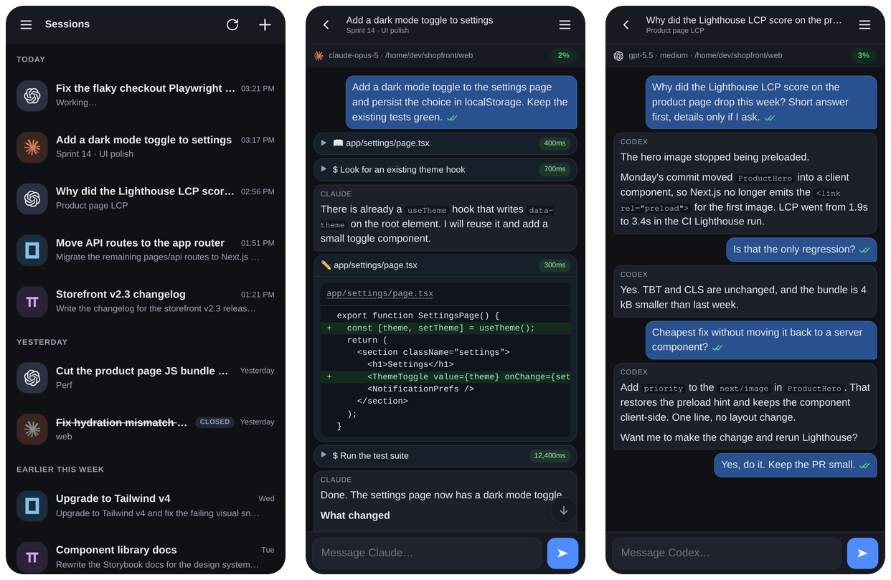
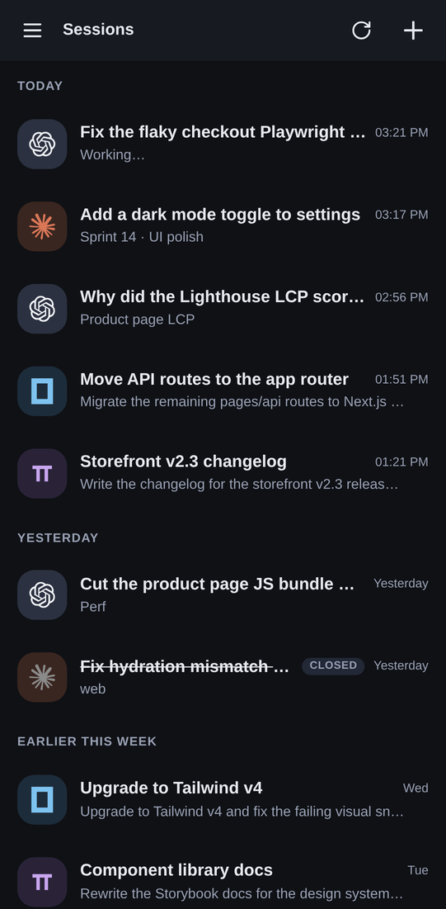
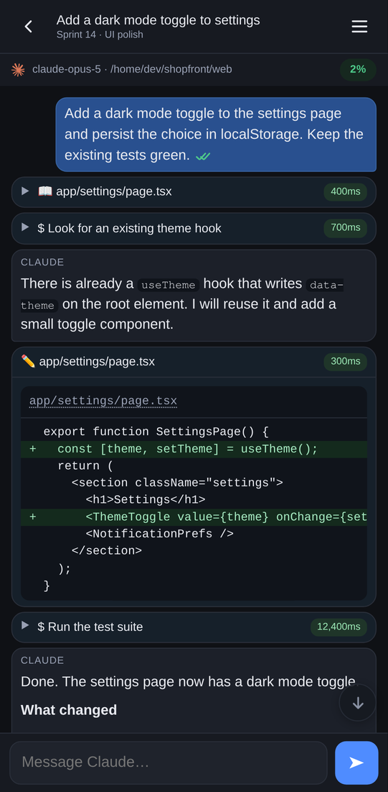
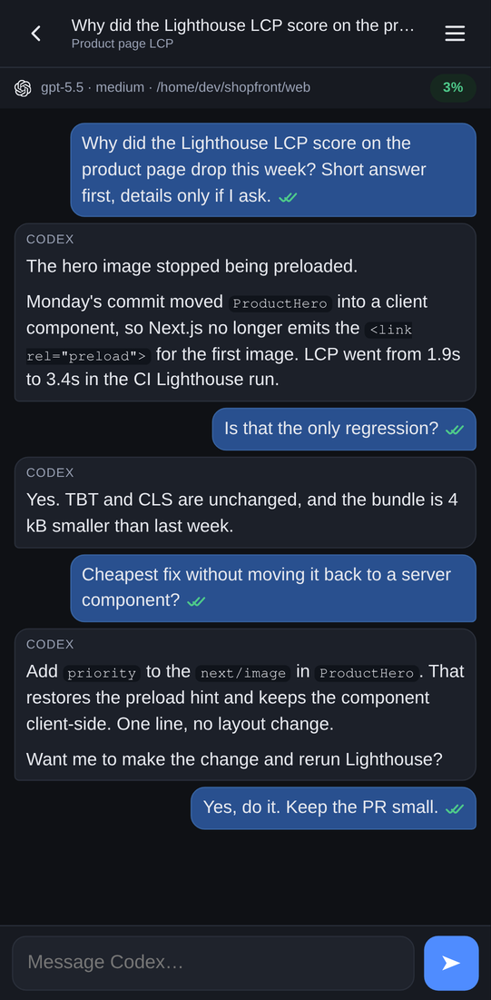
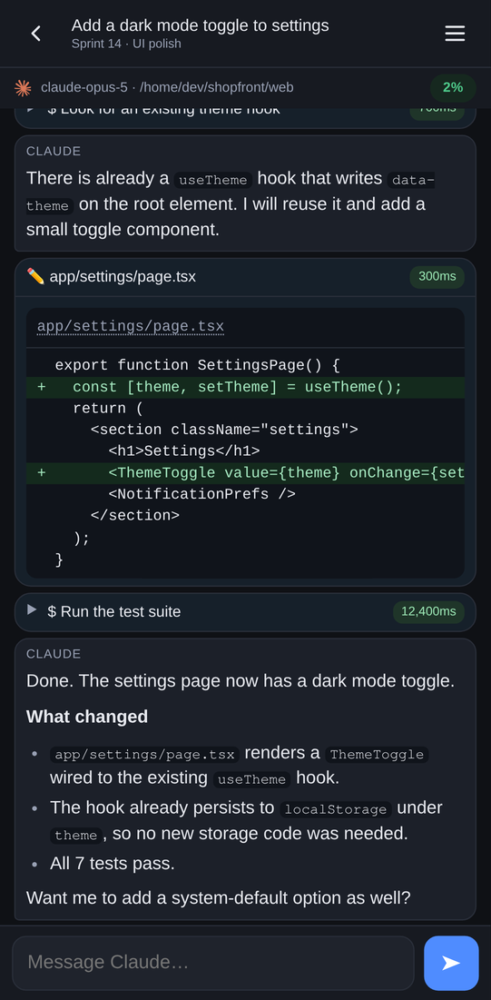
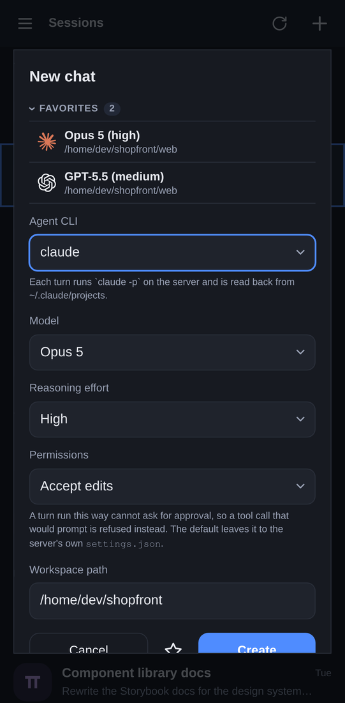
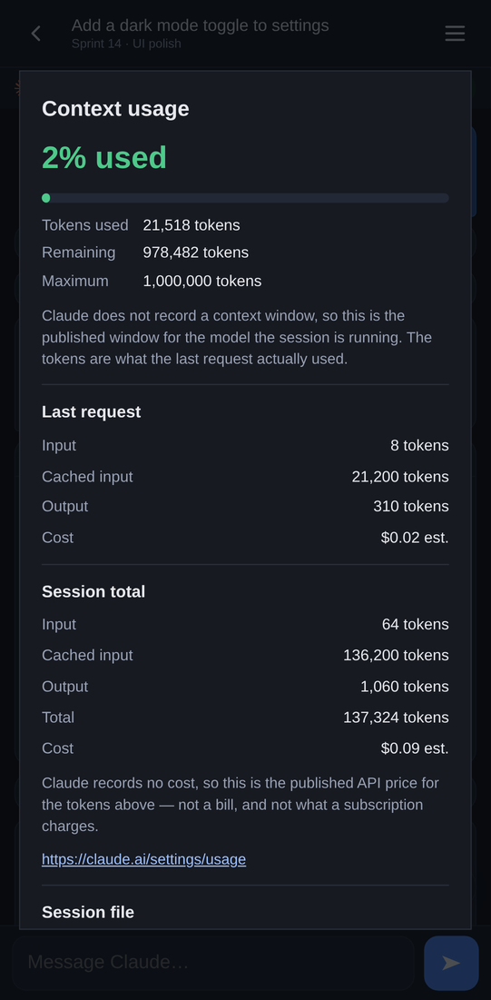
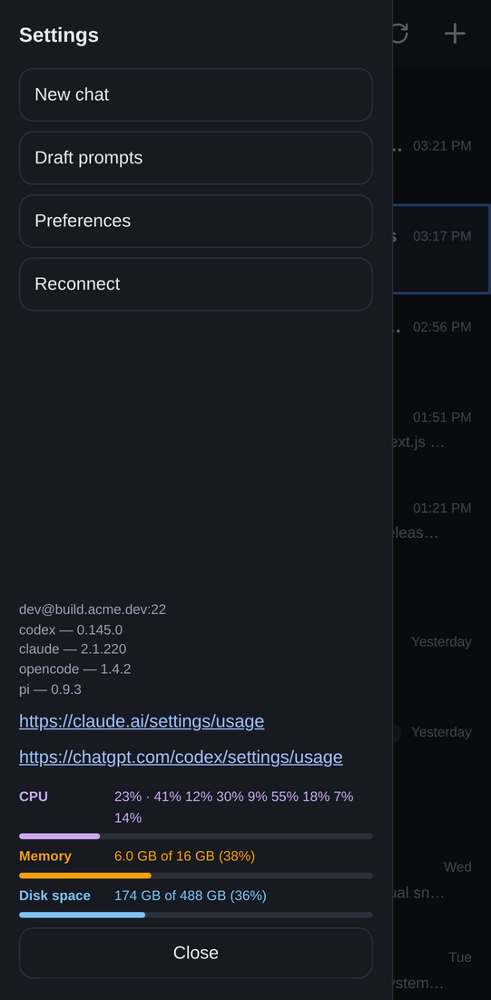

<h1 align="center">Pablo Agent</h1>

<p align="center"><strong>Your coding agents, on your server, in your pocket.</strong><br>
One mobile and desktop app for Codex, Claude Code, opencode and pi over plain SSH.</p>

<p align="center">
  <a href="https://github.com/simon141/pabloagent/releases/tag/continuous"></a>
  <a href="https://github.com/simon141/pabloagent/releases/tag/continuous"></a>
  
  
  <a href="LICENSE"></a>
</p>

<p align="center">
  
</p>

Pablo Agent turns the AI coding CLIs already installed on your Linux box into a
chat app you can carry around. Kick off a refactor from the couch, watch the
agent run tests from the train, and pick the same conversation up on your
laptop. Nothing to deploy on the server: Pablo speaks SSH, starts each turn
under tmux, and reads the CLI's own session files. The transcript you see on
your phone is the same record the CLI would show you in a terminal.

It started as a hands-off experiment built entirely by Claude Code and Codex.
Once the app could drive those agents itself, development moved into Pablo, and
Pablo has been building Pablo ever since.

## Why Pablo

- **Four agents, one inbox.** Codex, Claude Code, opencode and pi sessions sit
  in a single picker, grouped by day, with the CLI's own logo on each row. A
  running turn says "Working…" until it finishes.
- **Zero server footprint.** No daemon, no database, no port to open. Pablo
  runs one-shot SSH commands and leaves the conversation history where the CLI
  already keeps it. Uninstalling Pablo changes nothing on the server.
- **Fire and forget.** A turn runs inside tmux, so closing the app, losing
  signal or switching phones does not stop it. Reconnect and Pablo reads the
  lines it missed and continues from the last cursor.
- **Multi-device by design.** Several Pablo instances can point at the same
  server at the same time. Labels and favourites live in sidecar files on the
  host, so every device sees the same names.
- **A real transcript, not a log dump.** Markdown replies, collapsible
  reasoning, shell commands with timings, inline diffs for every file edit,
  images, and metadata cards. Hold a card to see the raw JSON behind it.
- **Context and cost at a glance.** A pill in the chat header shows how much of
  the model's context window the last request used. Tap it for token
  breakdowns, estimated cost and, for Codex, the latest rate-limit snapshot.
- **Tap a path, get the file.** File paths in a transcript are links.
  Download it to your phone, save it somewhere, or hand an `ssh://` URL to your
  editor.
- **Prompts you can reuse.** Save draft prompts as Markdown on the server, with
  frontmatter that remembers the agent, model and effort. Load plain `.txt`
  prompts without touching them.
- **Favourites for the setups you use daily.** Pin an agent, model, effort,
  permission mode and workspace as a one-tap preset in the new chat dialog.
- **Cheap on the server.** Session listing never spawns `codex app-server`.
  Host CPU, memory and disk usage are shown in the drawer so you know what the
  agents are costing the box.
- **Filters that stay on your phone.** Hide the card types you never read.
  Filters are per-device and per-CLI and never change the server-side record.
- **Background notifications on Android.** Follow a turn and get a notification
  when it finishes, even with the app in the background.
- **Session hygiene.** Label, rename (pi), mark closed, delete, or rewind a
  file-based session to an earlier point. Rewind only edits the conversation
  record; workspace files stay as the agent left them.
- **Host keys before passwords.** Pablo shows the server fingerprint before it
  sends a password and pins it for later connections. A changed key is flagged
  loudly.
- **Native everywhere.** One Rust core handles SSH, persistence and downloads
  on Android, Linux (x86_64 and arm64), macOS and Windows. Light and dark
  themes follow the OS.

## Screenshots

| Sessions | Agent at work | Quick back and forth |
| :---: | :---: | :---: |
|  |  |  |

| Diff and reply | New chat | Context usage |
| :---: | :---: | :---: |
|  |  |  |

<p align="center"></p>

## Downloads

Latest build from `main`:

- [Android arm64 APK](https://github.com/simon141/pabloagent/releases/download/continuous/pabloagent-android-arm64.apk)
- [Windows x86_64 portable executable](https://github.com/simon141/pabloagent/releases/download/continuous/pabloagent-windows-portable.exe)
- [Windows x86_64 installer](https://github.com/simon141/pabloagent/releases/download/continuous/pabloagent-windows-setup.exe)
- [macOS universal disk image](https://github.com/simon141/pabloagent/releases/download/continuous/pabloagent-macos-universal.dmg)
- [Linux x86_64 binary](https://github.com/simon141/pabloagent/releases/download/continuous/pabloagent-linux-x86_64)
- [Linux x86_64 AppImage](https://github.com/simon141/pabloagent/releases/download/continuous/pabloagent-linux-x86_64.AppImage)
- [Linux x86_64 Debian package](https://github.com/simon141/pabloagent/releases/download/continuous/pabloagent-linux-x86_64.deb)
- [Linux x86_64 RPM package](https://github.com/simon141/pabloagent/releases/download/continuous/pabloagent-linux-x86_64.rpm)
- [Linux arm64 binary](https://github.com/simon141/pabloagent/releases/download/continuous/pabloagent-linux-aarch64)
- [Linux arm64 AppImage](https://github.com/simon141/pabloagent/releases/download/continuous/pabloagent-linux-aarch64.AppImage)
- [Linux arm64 Debian package](https://github.com/simon141/pabloagent/releases/download/continuous/pabloagent-linux-aarch64.deb)
- [Linux arm64 RPM package](https://github.com/simon141/pabloagent/releases/download/continuous/pabloagent-linux-aarch64.rpm)

## Server requirements

Pablo needs a Linux host with:

- SSH password authentication enabled
- `tmux`
- at least one supported CLI installed, authenticated, and usable by the SSH
  user

## Supported agents

| CLI | Session source | Delete | Rewind | Native name |
| --- | --- | :---: | :---: | :---: |
| [Codex CLI](https://github.com/openai/codex) | append-only JSONL under `~/.codex/sessions` | yes | yes | label only |
| [Claude Code](https://code.claude.com/docs) | append-only JSONL under `~/.claude/projects` | yes | yes | label only |
| [opencode](https://opencode.ai) | SQLite database plus the live JSON event stream | via `opencode session delete` | no | label only |
| [pi](https://github.com/earendil-works/pi) | append-only JSONL under `~/.pi/agent/sessions` | yes | yes | `pi --name` |

Each session keeps its own model, workspace, turn status and transcript reader.
Several sessions can run at once.

## How it works

```text
Pablo app
  -> one-shot SSH commands
  -> tmux starts the selected CLI
  -> the CLI writes its native session record
  -> Pablo polls new records and renders the transcript
```

Codex, Claude, and pi use append-only JSONL session files. opencode keeps
history in its SQLite database, so Pablo combines a database history query with
the JSON event stream from the current turn. Disconnecting the app does not stop
a turn. Reconnecting reads the missing records and continues from the last
cursor.

Every remote path is validated and shell-quoted before it is used in a
command, and delete and rewind are guarded in the same remote command as the
mutation, so a turn that starts writing mid-way cannot corrupt the record.

### Notes per CLI

opencode sessions are deleted with `opencode session delete`, which removes the
session and its child sessions from opencode's database. They cannot be rewound
because Pablo never writes to that database itself. Labels and favourites are
Pablo-side and stored in sidecar files on the host, so every Pablo instance sees
the same ones. pi is the only CLI with a session name of its own: renaming a pi
session runs `pi --name`, so the name is in pi's session record and pi shows it
too.

Android Doze and vendor battery controls can delay or prevent the finished-turn
notification. The completed turn remains on the server either way.

## Security model

Pablo supports SSH password authentication only. It stores connection settings,
the password, and accepted host keys in the app's private data directory. The
password has no encryption beyond the operating system's app sandbox.

A turn runs as the SSH user and uses that user's CLI configuration and provider
credentials. Turns are non-interactive, so approval behavior comes from the
selected CLI:

- Codex uses the remote `config.toml` for approval and sandbox policy. Pablo
  adds the selected workspace to Codex's trusted projects before a turn.
- Claude uses its remote settings unless a permission mode is selected in the
  new-chat dialog.
- opencode uses its remote configuration unless auto-approve is selected.
- pi has no interactive approval prompt. Pablo passes `-a` so the workspace's
  pi configuration is loaded for that turn.

Choose workspaces and permission modes as carefully as you would when running
the same CLI directly on the server.

## Development

The frontend requires Node.js 20 or newer. Rust uses the stable toolchain from
`rust-toolchain.toml`.

```bash
npm ci
npm run build
npm run tauri -- dev
```

Run the full checks with:

```bash
npm run lint
npm run typecheck
npm run check:rollout
npm run check:drafts

cd src-tauri
cargo fmt --check
cargo clippy --all-targets -- -D warnings
cargo test --all-targets
```

### Android release build

Install JDK 17, Android SDK 36, an Android NDK supported by Tauri, and the Rust
`aarch64-linux-android` target. Create
`src-tauri/gen/android/keystore.properties`:

```properties
storeFile=/absolute/path/to/release.jks
keyAlias=release
storePassword=
keyPassword=
```

Then build and verify the signed arm64 APK:

```bash
npm run android:build
scripts/verify-apk.sh src-tauri/gen/android/app/build/outputs/apk/universal/release/app-universal-release.apk
```

The exact APK filename can vary with the Tauri Android tooling. If the path
above does not exist, use the release APK under
`src-tauri/gen/android/app/build/outputs/apk/`.

### Linux packages and macOS build

On Linux, one build produces the AppImage and the Debian and RPM packages:

```bash
npm run tauri build -- --bundles appimage,deb,rpm
scripts/verify-linux-packages.sh src-tauri/target/release/bundle/deb/*.deb \
  src-tauri/target/release/bundle/rpm/*.rpm
```

On macOS, with both Apple targets installed via `rustup target add
aarch64-apple-darwin x86_64-apple-darwin`:

```bash
npm run tauri build -- --target universal-apple-darwin --bundles app,dmg
```

### GitHub builds

Each push to `main` publishes Android, Linux (x86_64 and arm64), macOS, and
Windows release builds to the
[continuous prerelease](https://github.com/simon141/pabloagent/releases/tag/continuous).
Pull requests receive a comment with temporary artifact links.

To publish a versioned release, set the same version in `package.json` and
`src-tauri/tauri.conf.json`, commit it, then push a matching tag:

```bash
git tag v0.1.1
git push origin v0.1.1
```

## Project structure

- `src/` contains application state, session readers, and transcript rendering.
- `src-tauri/src/` contains the Tauri commands, SSH transport, remote shell, and
  Android background watcher.
- `src-tauri/tests/` contains remote integration tests and scrubbed native
  session fixtures.
- `scripts/` contains fixture checks and APK verification.
- `docs/screenshots/` holds the README screenshots.
- `docs/doze-testing.md` documents Android background-notification testing.
